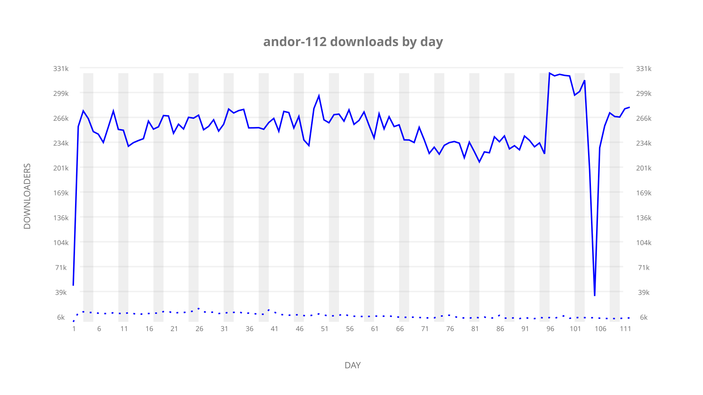
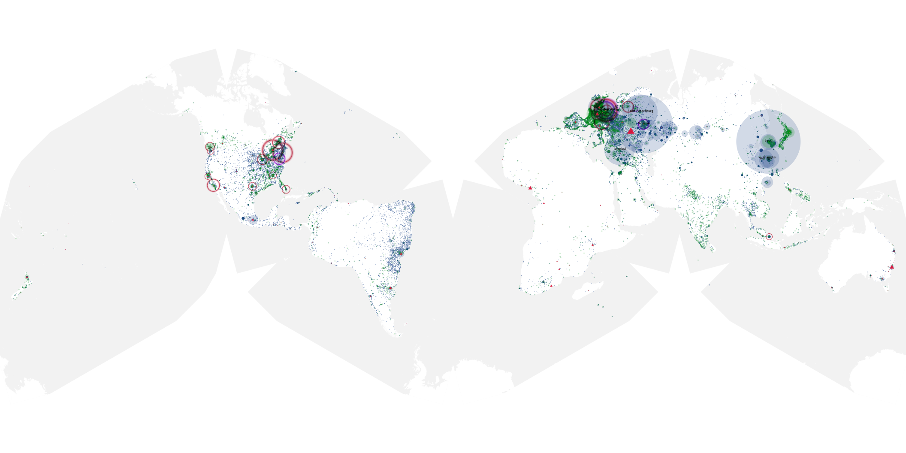
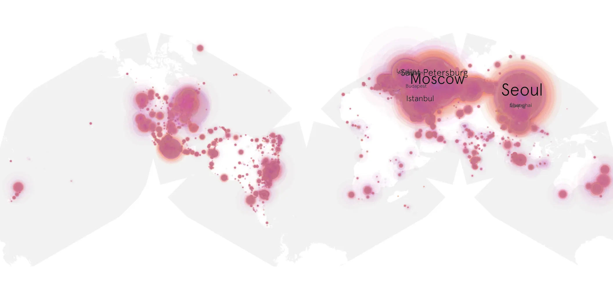
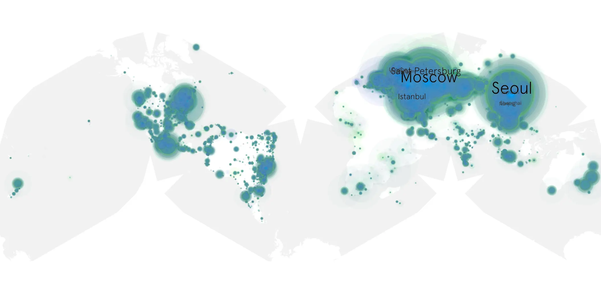

# andor-112 sample cache audit

## 1. Media object

| Field | Value |
| --- | --- |
| Media object | Andor |
| Collection key | `andor-112` |
| imdb_id | [tt9253284](https://www.imdb.com/title/tt9253284/) |
| wikipedia_url | [Andor](https://en.wikipedia.org/wiki/Andor) |
| Sample dates | 2025-04-23-to-2025-08-12 |
| Sample days | 112 |
| BTIH count | 242 |
| Unique BTIH count | 199 |
| Downloaders total | 23,395,559 |
| Uploaders total | 837,613 |
| Data version | `2026-08-05` |
| IP geolocation version | `6:1777968300` |

## 2. Coverage report

- Generated: 2026-09-10T05:59:44Z
- Sample archive directory: `/mnt/gold/src/alpha60-samples-raw.gold/andor-112.xz/2025`
- Hour directories: 2668
- Zero-length sample files: 0
- Other unparsable sample files: 0
- Hourly discontinuities: 0 (0 missing hours)
- Missing days: 0

### Sample archive discontinuities

None detected.

## 3. File sizes histogram *median[lowest, highest]*

## 4. Graphs

### Downloads by week cumulative (normalized start)



### Downloads by day, Saturday and Sunday in gray

## 5. Cumulative Maps

<!-- https://raw.githubusercontent.com/alpha60-devops/alpha60-results-2025/refs/heads/main/data/ -->

### <a href="https://raw.githubusercontent.com/alpha60-devops/alpha60-results-2025/refs/heads/main/data/geojson.cumulative/andor-112-cumulative-aggregate.geojson.gz" data-map-title="Andor — andor-112" onclick="leaflet_map_open_window(this.href, this.dataset.mapTitle); return false;" class="table-link" aria-label="Open Andor (andor-112) cumulative data map in new window" title="Opens interactive map for Andor (andor-112) data">Swarm Detail</a>

### Geographic Regions

| Africa | Americas | Asia | Europe | Oceania | Unknown |
| --- | --- | --- | --- | --- | --- |
| 1.01 | 14.95 | 28.66 | 52.08 | 1.04 | 0.61 |

### Network infrastructure

{:target="_blank" rel="noopener"}

### Resolution >= 1080p

{:target="_blank" rel="noopener"}

### Resolution < 1080p

{:target="_blank" rel="noopener"}
