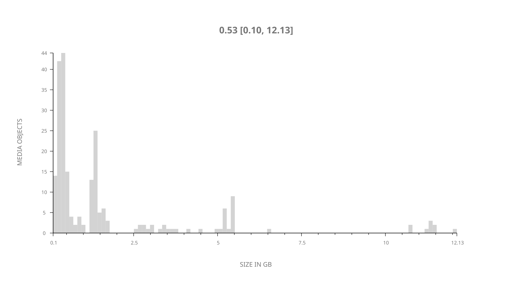
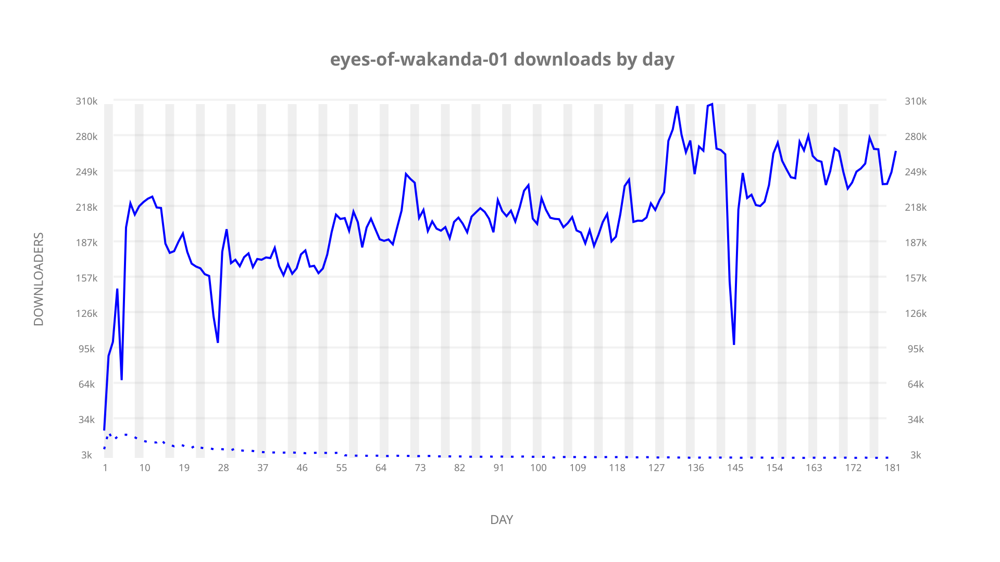
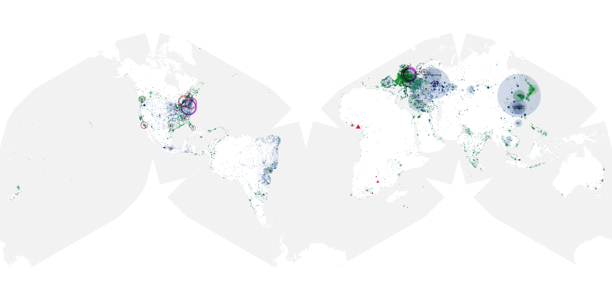
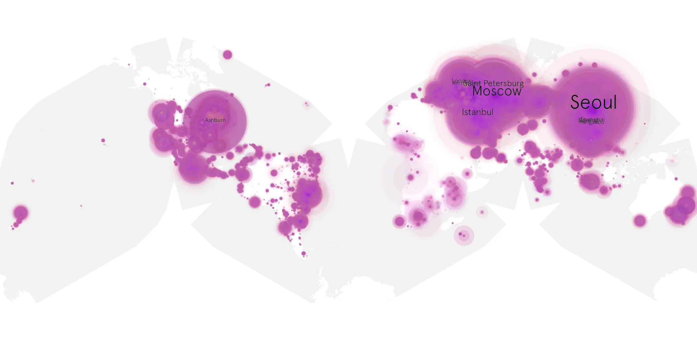
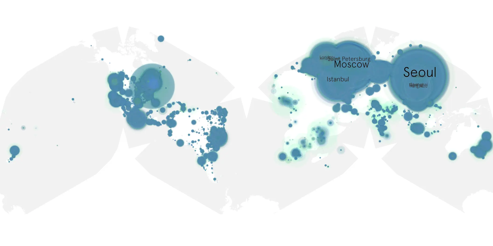

# eyes-of-wakanda-01 sample cache audit

## 1. Media object

| Field | Value |
| --- | --- |
| Media object | Eyes of Wakanda |
| Collection key | `eyes-of-wakanda-01` |
| imdb_id | [tt13968252](https://www.imdb.com/title/tt13968252/) |
| wikipedia_url | [Eyes of Wakanda](https://en.wikipedia.org/wiki/Eyes_of_Wakanda) |
| Sample dates | 2025-08-01-to-2026-01-29 |
| Sample days | 182 |
| BTIH count | 223 |
| Unique BTIH count | 223 |
| Downloaders total | 30,938,193 |
| Uploaders total | 570,861 |
| Data version | `2026-06-18` |
| IP geolocation version | `6:1777968300` |

## 2. Coverage report

- Evidence: completed year AAO release and serialized week product
- Release generated: 2026-08-07T04:29:58Z
- Release complete: true
- Manifest payloads verified: 2264/2264
- Manifest SHA-256: `4a4818facd85b709f0321b0a6de31b4a3eff6f108f3b9354c75632926e6baa48`
- Sample duration: `2025-08-01-to-2026-01-29`
- Sample days: 182
- Serialized week intervals: 26
- Data version: `2026-06-18`
- IP geolocation version: `6:1777968300`

### Sparse weekly intervals

None recorded for this media object.

### Evidence boundary

This section reuses the checksum-verified AAO release evidence.
No raw sample was reopened and no week or cumulative product was
regenerated for the day-only augmentation.

## 3. File sizes histogram *median[lowest, highest]*

## 4. Graphs

### Downloads by week cumulative (normalized start)



### Downloads by day, Saturday and Sunday in gray

## 5. Cumulative Maps

<!-- https://raw.githubusercontent.com/alpha60-devops/alpha60-results-2025/refs/heads/main/data/ -->

### <a href="https://raw.githubusercontent.com/alpha60-devops/alpha60-results-2025/refs/heads/main/data/geojson.cumulative/eyes-of-wakanda-01-cumulative-aggregate.geojson.gz" data-map-title="Eyes of Wakanda — eyes-of-wakanda-01" onclick="leaflet_map_open_window(this.href, this.dataset.mapTitle); return false;" class="table-link" aria-label="Open Eyes of Wakanda (eyes-of-wakanda-01) cumulative data map in new window" title="Opens interactive map for Eyes of Wakanda (eyes-of-wakanda-01) data">Swarm Detail</a>

### Geographic Regions

| Africa | Americas | Asia | Europe | Oceania | Unknown |
| --- | --- | --- | --- | --- | --- |
| 1.31 | 16.14 | 31.51 | 47.59 | 0.97 | 0.62 |

### Network infrastructure

{:target="_blank" rel="noopener"}

### Resolution >= 1080p

{:target="_blank" rel="noopener"}

### Resolution < 1080p

{:target="_blank" rel="noopener"}
