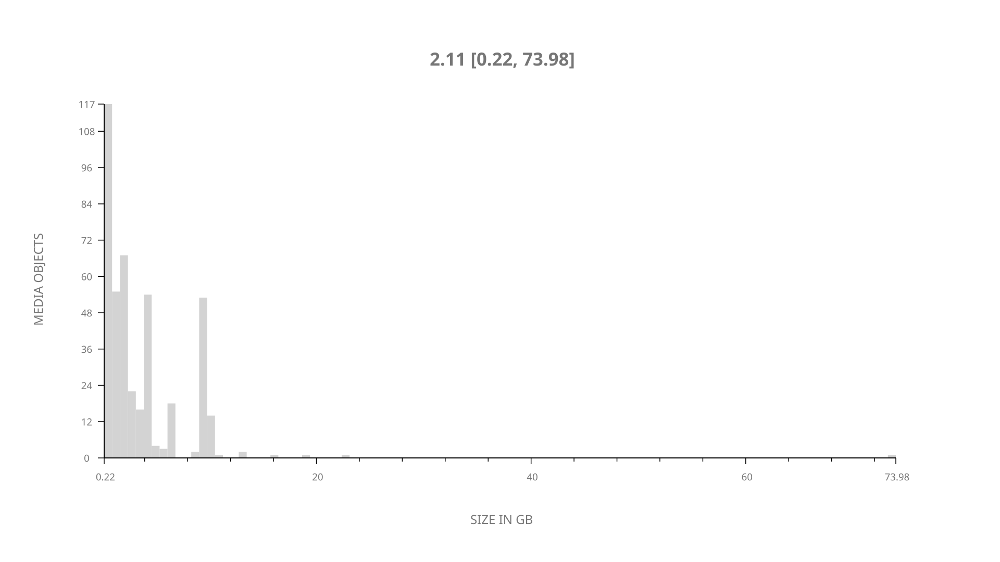
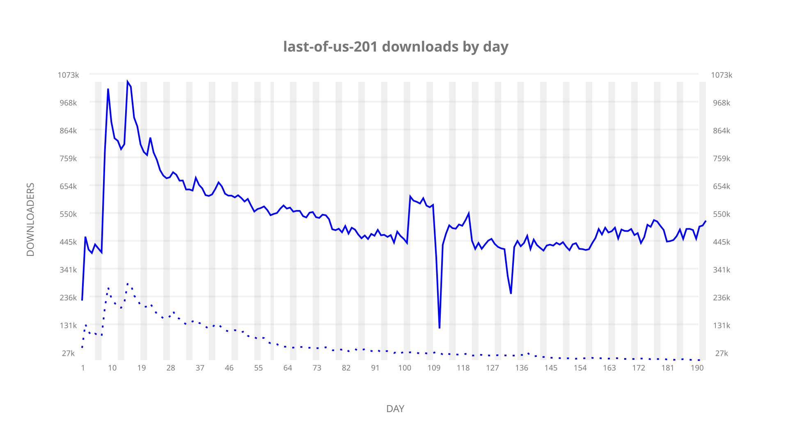
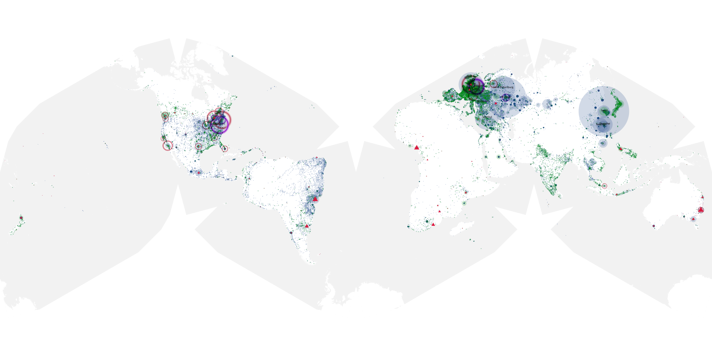
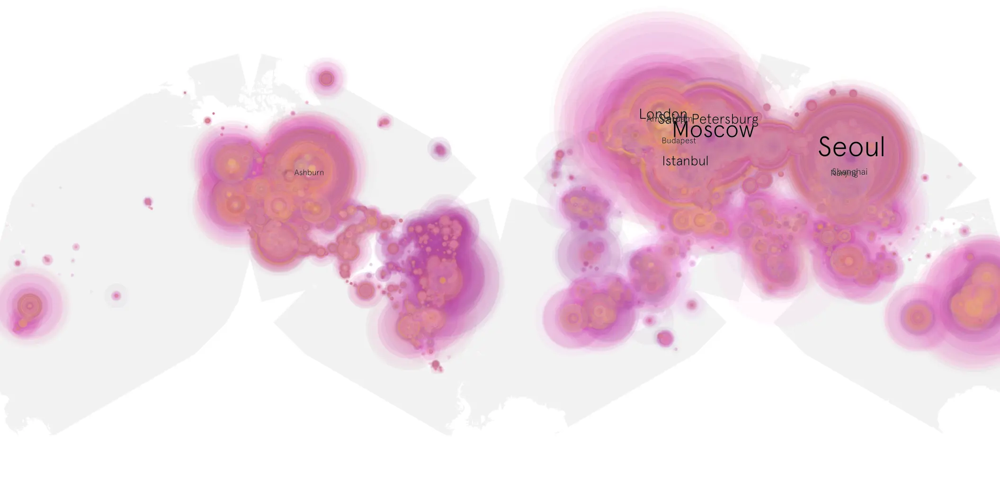
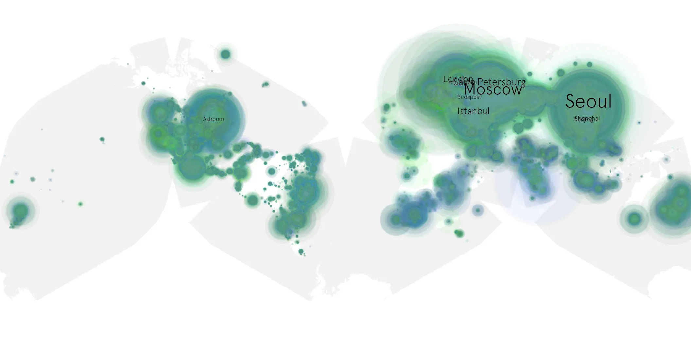

# last-of-us-201 sample cache audit

## 1. Media object

| Field | Value |
| --- | --- |
| Media object | Last of Us |
| Collection key | `last-of-us-201` |
| imdb_id | [tt3581920](https://www.imdb.com/title/tt3581920/) |
| wikipedia_url | [The Last of Us (TV series)](https://en.wikipedia.org/wiki/The_Last_of_Us_(TV_series)) |
| Sample dates | 2025-04-14-to-2025-10-26 |
| Sample days | 196 |
| BTIH count | 448 |
| Unique BTIH count | 432 |
| Downloaders total | 72,627,362 |
| Uploaders total | 7,088,622 |
| Data version | `2026-06-18` |
| IP geolocation version | `6:1777968300` |

## 2. Coverage report

- Evidence: completed year AAO release and serialized week product
- Release generated: 2026-08-30T16:41:11-07:00
- Release complete: true
- Manifest payloads verified: 2266/2266
- Manifest SHA-256: `f7cccd77fa83baa7a24036fc961f1c1131634582d18b5ad42de6adbd4b42c313`
- Sample duration: `2025-04-14-to-2025-10-26`
- Sample days: 196
- Serialized week intervals: 28
- Data version: `2026-06-18`
- IP geolocation version: `6:1777968300`

### Sparse weekly intervals

None recorded for this media object.

### Evidence boundary

This section reuses the checksum-verified AAO release evidence.
No raw sample was reopened and no week or cumulative product was
regenerated for the day-only augmentation.

## 3. File sizes histogram *median[lowest, highest]*

## 4. Graphs

### Downloads by week cumulative (normalized start)



### Downloads by day, Saturday and Sunday in gray

## 5. Cumulative Maps

<!-- https://raw.githubusercontent.com/alpha60-devops/alpha60-results-2025/refs/heads/main/data/ -->

### <a href="https://raw.githubusercontent.com/alpha60-devops/alpha60-results-2025/refs/heads/main/data/geojson.cumulative/last-of-us-201-cumulative-aggregate.geojson.gz" data-map-title="Last of Us — last-of-us-201" onclick="leaflet_map_open_window(this.href, this.dataset.mapTitle); return false;" class="table-link" aria-label="Open Last of Us (last-of-us-201) cumulative data map in new window" title="Opens interactive map for Last of Us (last-of-us-201) data">Swarm Detail</a>

### Geographic Regions

| Africa | Americas | Asia | Europe | Oceania | Unknown |
| --- | --- | --- | --- | --- | --- |
| 1.89 | 18.02 | 28.10 | 48.51 | 1.63 | 0.57 |

### Network infrastructure

{:target="_blank" rel="noopener"}

### Resolution >= 1080p

{:target="_blank" rel="noopener"}

### Resolution < 1080p

{:target="_blank" rel="noopener"}
