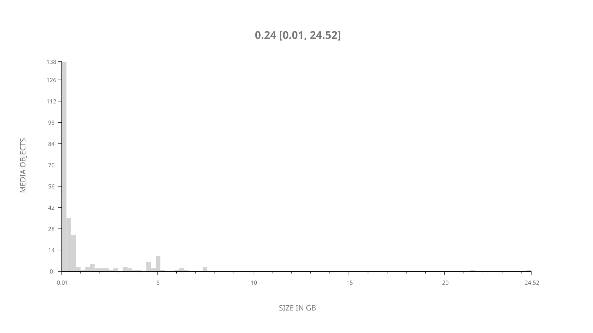
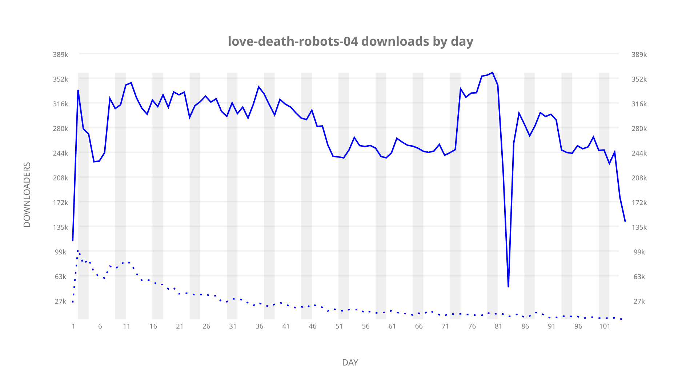
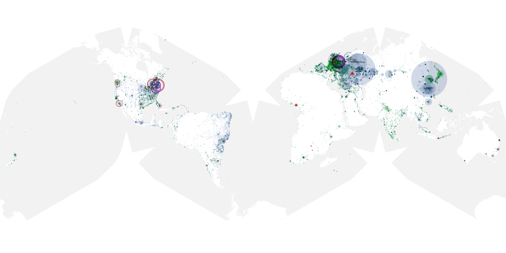
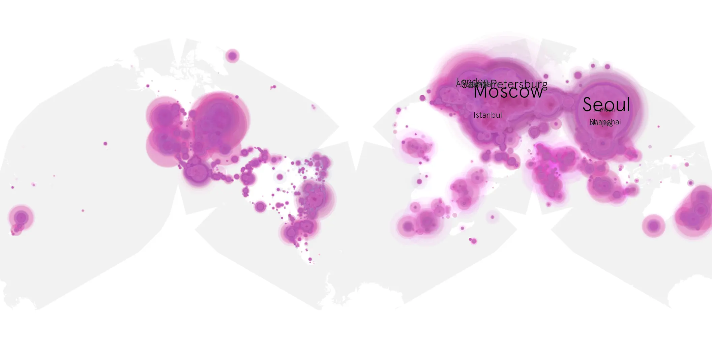
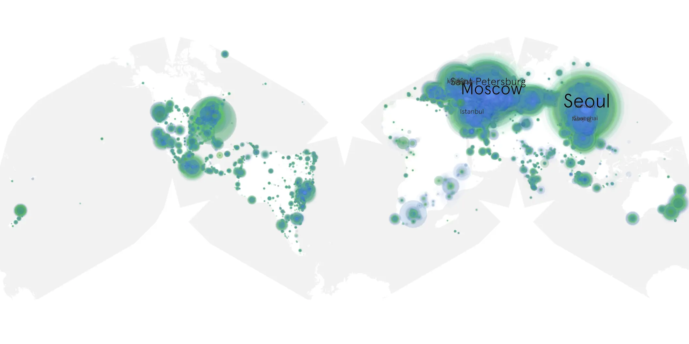

# love-death-robots-04 sample cache audit

## 1. Media object

| Field | Value |
| --- | --- |
| Media object | Love, Death & Robots |
| Collection key | `love-death-robots-04` |
| imdb_id | [tt9561862](https://www.imdb.com/title/tt9561862/) |
| wikipedia_url | [Love, Death & Robots](https://en.wikipedia.org/wiki/Love,_Death_%26_Robots) |
| Sample dates | 2025-05-15-to-2025-08-27 |
| Sample days | 105 |
| BTIH count | 267 |
| Unique BTIH count | 253 |
| Downloaders total | 22,474,072 |
| Uploaders total | 2,194,024 |
| Data version | `2026-06-18` |
| IP geolocation version | `6:1777968300` |

## 2. Coverage report

- Evidence: completed year AAO release and serialized week product
- Release generated: 2026-08-07T04:29:58Z
- Release complete: true
- Manifest payloads verified: 2264/2264
- Manifest SHA-256: `4a4818facd85b709f0321b0a6de31b4a3eff6f108f3b9354c75632926e6baa48`
- Sample duration: `2025-05-15-to-2025-08-27`
- Sample days: 105
- Serialized week intervals: 15
- Data version: `2026-06-18`
- IP geolocation version: `6:1777968300`

### Sparse weekly intervals

None recorded for this media object.

### Evidence boundary

This section reuses the checksum-verified AAO release evidence.
No raw sample was reopened and no week or cumulative product was
regenerated for the day-only augmentation.

## 3. File sizes histogram *median[lowest, highest]*

## 4. Graphs

### Downloads by week cumulative (normalized start)



### Downloads by day, Saturday and Sunday in gray

## 5. Cumulative Maps

<!-- https://raw.githubusercontent.com/alpha60-devops/alpha60-results-2025/refs/heads/main/data/ -->

### <a href="https://raw.githubusercontent.com/alpha60-devops/alpha60-results-2025/refs/heads/main/data/geojson.cumulative/love-death-robots-04-cumulative-aggregate.geojson.gz" data-map-title="Love, Death &amp; Robots — love-death-robots-04" onclick="leaflet_map_open_window(this.href, this.dataset.mapTitle); return false;" class="table-link" aria-label="Open Love, Death &amp; Robots (love-death-robots-04) cumulative data map in new window" title="Opens interactive map for Love, Death &amp; Robots (love-death-robots-04) data">Swarm Detail</a>

### Geographic Regions

| Africa | Americas | Asia | Europe | Oceania | Unknown |
| --- | --- | --- | --- | --- | --- |
| 1.56 | 16.43 | 28.49 | 49.82 | 1.39 | 0.65 |

### Network infrastructure

{:target="_blank" rel="noopener"}

### Resolution >= 1080p

{:target="_blank" rel="noopener"}

### Resolution < 1080p

{:target="_blank" rel="noopener"}
