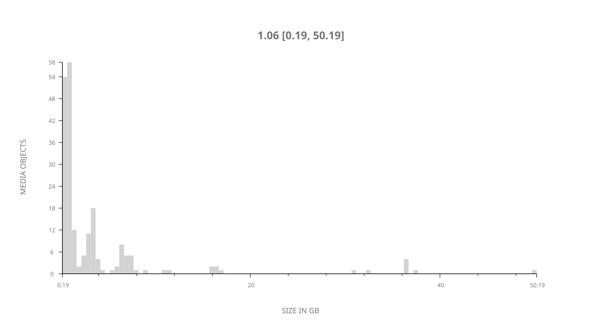
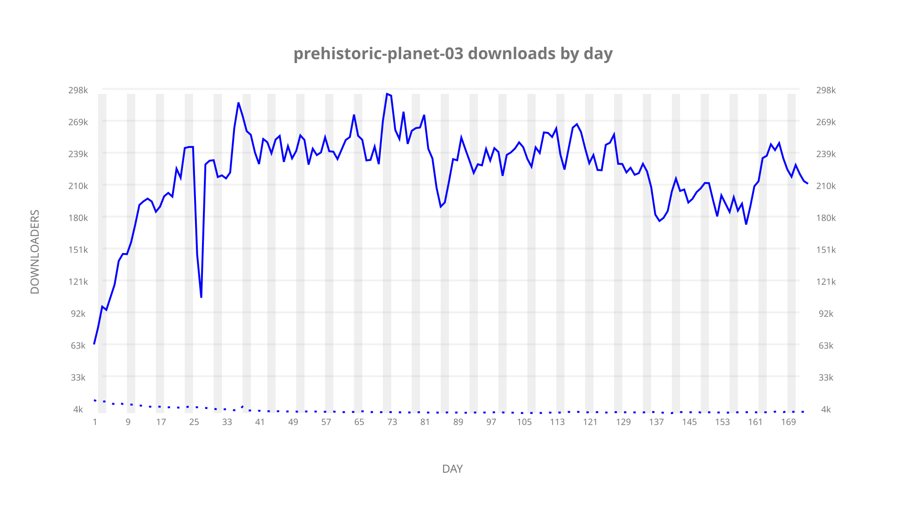
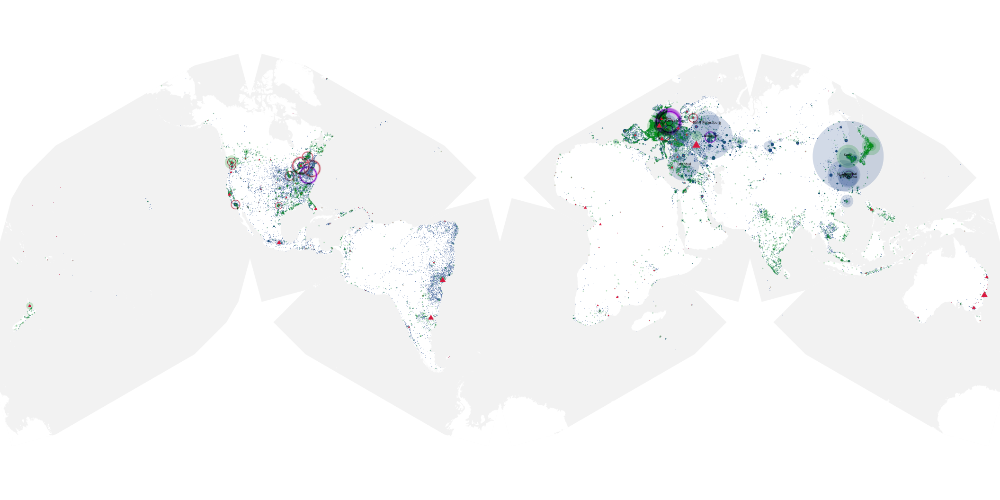
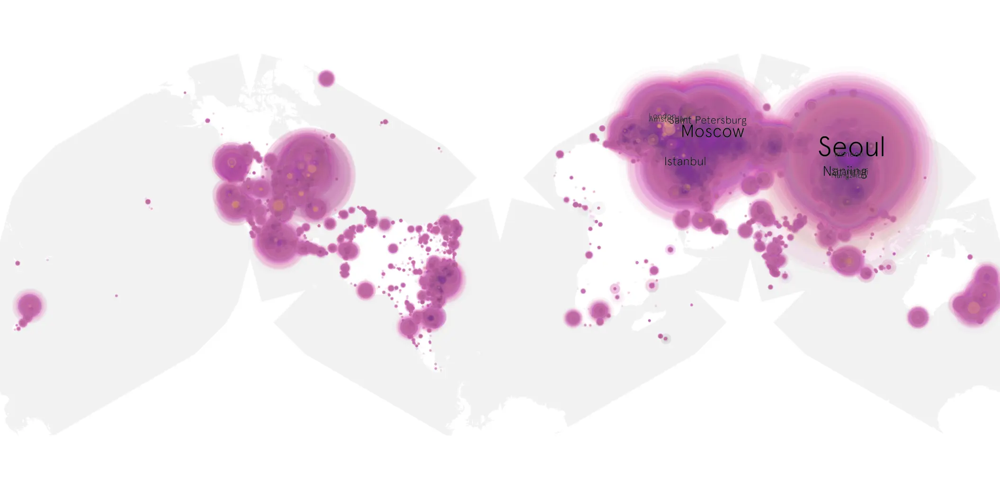
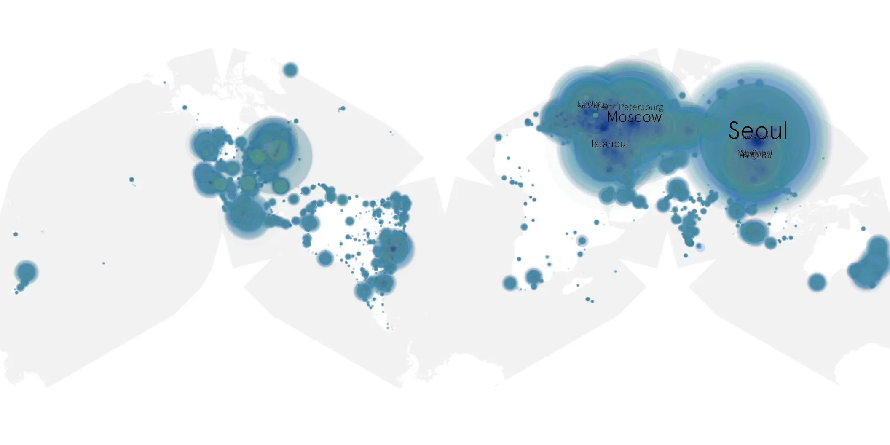

# prehistoric-planet-03 sample cache audit

## 1. Media object

| Field | Value |
| --- | --- |
| Media object | Prehistoric Planet |
| Collection key | `prehistoric-planet-03` |
| imdb_id | [tt10324164](https://www.imdb.com/title/tt10324164/) |
| wikipedia_url | [Prehistoric Planet](https://en.wikipedia.org/wiki/Prehistoric_Planet) |
| Sample dates | 2025-11-27-to-2026-05-27 |
| Sample days | 182 |
| BTIH count | 225 |
| Unique BTIH count | 203 |
| Downloaders total | 32,233,434 |
| Uploaders total | 435,902 |
| Data version | `2026-06-18` |
| IP geolocation version | `6:1777968300` |

## 2. Sample coverage report

- Evidence: completed year AAO release and serialized week product
- Release generated: 2026-08-07T04:29:58Z
- Release complete: true
- Manifest payloads verified: 2264/2264
- Manifest SHA-256: `4a4818facd85b709f0321b0a6de31b4a3eff6f108f3b9354c75632926e6baa48`
- Sample duration: `2025-11-27-to-2026-05-27`
- Sample days: 182
- Serialized week intervals: 26
- Data version: `2026-06-18`
- IP geolocation version: `6:1777968300`

### Sparse weekly intervals

None recorded for this media object.

### Evidence boundary

This section reuses the checksum-verified AAO release evidence.
No raw sample was reopened and no week or cumulative product was
regenerated for the day-only augmentation.

## 3. Media objects file size histogram

## 4. Visualization pass — graphs

### Downloads by week cumulative (normalized start)



### Downloads by day, Saturday and Sunday in gray

## 5. Visualization pass — maps

### Cumulative geographic slices

| Africa | Americas | Asia | Europe | Oceania | Unknown |
| --- | --- | --- | --- | --- | --- |
| 0.88 | 14.21 | 34.00 | 47.53 | 1.03 | 0.71 |

### Cumulative network infrastructure

{:target="_blank" rel="noopener"}

### Cumulative data maps

**Cumulative >= 1080p**

{:target="_blank" rel="noopener"}

**Cumulative < 1080p**

{:target="_blank" rel="noopener"}
