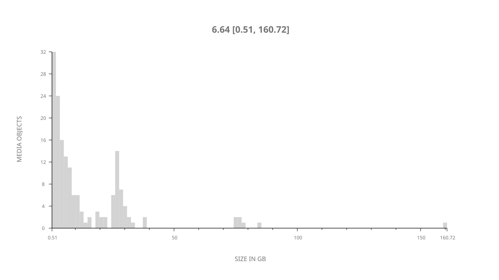
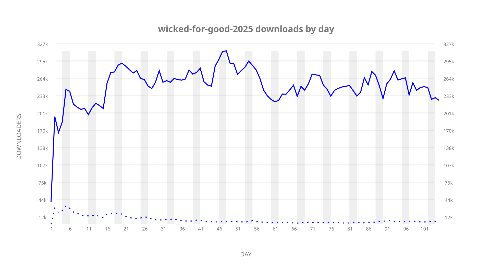
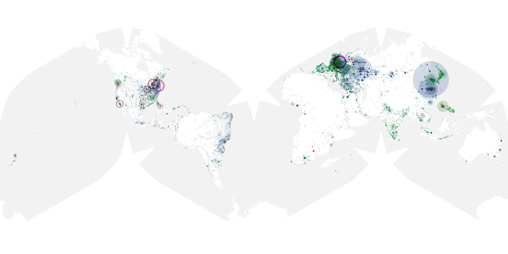
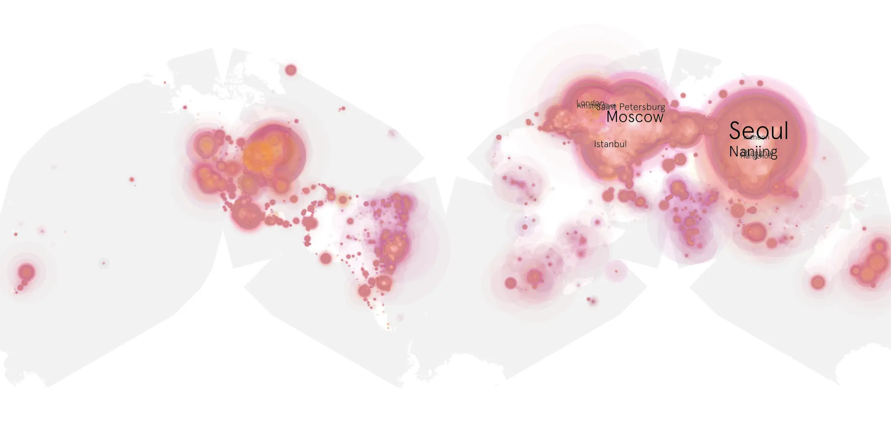
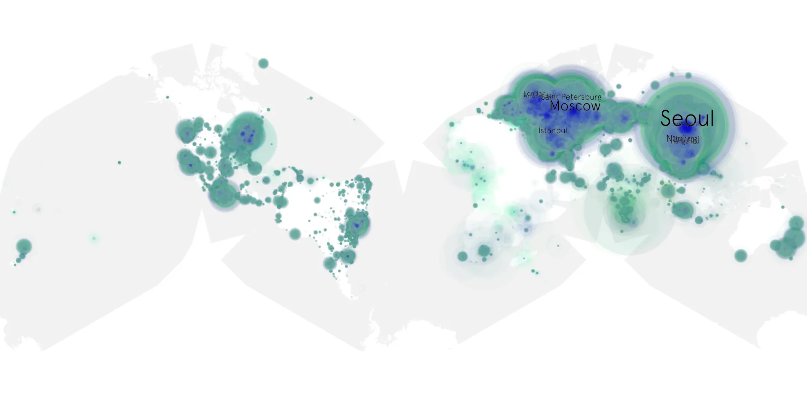

# wicked-for-good-2025 sample cache audit

## 1. Media object

| Field | Value |
| --- | --- |
| Media object | Wicked: For Good |
| Collection key | `wicked-for-good-2025` |
| imdb_id | [tt19847976](https://www.imdb.com/title/tt19847976/) |
| wikipedia_url | [Wicked: For Good](https://en.wikipedia.org/wiki/Wicked:_For_Good) |
| Sample dates | 2025-12-30-to-2026-04-13 |
| Sample days | 105 |
| BTIH count | 180 |
| Unique BTIH count | 164 |
| Downloaders total | 20,407,800 |
| Uploaders total | 845,289 |
| Data version | `2026-06-18` |
| IP geolocation version | `6:1777968300` |

## 2. Coverage report

- Evidence: completed year AAO release and serialized week product
- Release generated: 2026-08-07T04:29:58Z
- Release complete: true
- Manifest payloads verified: 2264/2264
- Manifest SHA-256: `4a4818facd85b709f0321b0a6de31b4a3eff6f108f3b9354c75632926e6baa48`
- Sample duration: `2025-12-30-to-2026-04-13`
- Sample days: 105
- Serialized week intervals: 15
- Data version: `2026-06-18`
- IP geolocation version: `6:1777968300`

### Sparse weekly intervals

None recorded for this media object.

### Evidence boundary

This section reuses the checksum-verified AAO release evidence.
No raw sample was reopened and no week or cumulative product was
regenerated for the day-only augmentation.

## 3. File sizes histogram *median[lowest, highest]*

## 4. Graphs

### Downloads by week cumulative (normalized start)



### Downloads by day, Saturday and Sunday in gray

## 5. Cumulative Maps

<!-- https://raw.githubusercontent.com/alpha60-devops/alpha60-results-2025/refs/heads/main/data/ -->

### <a href="https://raw.githubusercontent.com/alpha60-devops/alpha60-results-2025/refs/heads/main/data/geojson.cumulative/wicked-for-good-2025-cumulative-aggregate.geojson.gz" data-map-title="Wicked: For Good — wicked-for-good-2025" onclick="leaflet_map_open_window(this.href, this.dataset.mapTitle); return false;" class="table-link" aria-label="Open Wicked: For Good (wicked-for-good-2025) cumulative data map in new window" title="Opens interactive map for Wicked: For Good (wicked-for-good-2025) data">Swarm Detail</a>

### Geographic Regions

| Africa | Americas | Asia | Europe | Oceania | Unknown |
| --- | --- | --- | --- | --- | --- |
| 1.43 | 14.64 | 33.69 | 45.50 | 1.23 | 0.68 |

### Network infrastructure

{:target="_blank" rel="noopener"}

### Resolution >= 1080p

{:target="_blank" rel="noopener"}

### Resolution < 1080p

{:target="_blank" rel="noopener"}
