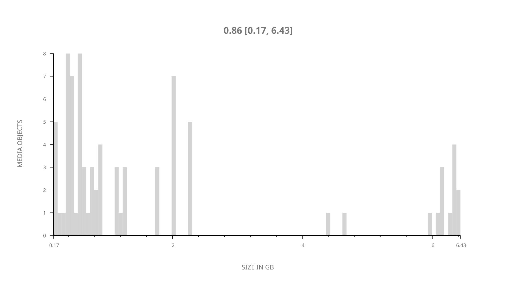
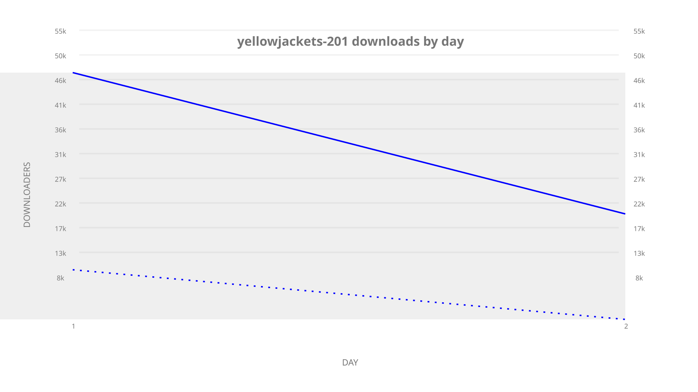
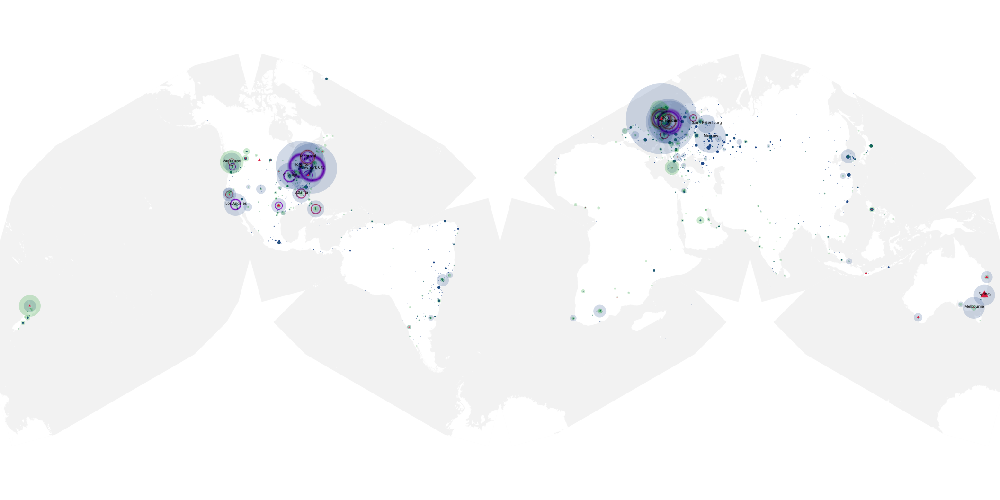
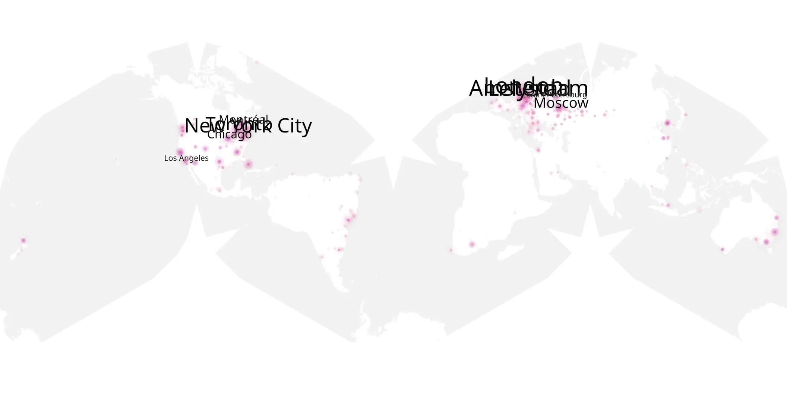
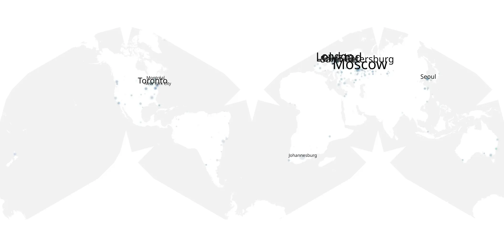

# yellowjackets-201 sample cache audit

## 1. Media object

| Field | Value |
| --- | --- |
| Media object | Yellowjackets |
| Collection key | `yellowjackets-201` |
| imdb_id | [tt11041332](https://www.imdb.com/title/tt11041332/) |
| wikipedia_url | [Yellowjackets (TV series)](https://en.wikipedia.org/wiki/Yellowjackets_(TV_series)) |
| Sample dates | 2025-02-15-to-2025-02-16 |
| Sample days | 2 |
| BTIH count | 86 |
| Unique BTIH count | 80 |
| Downloaders total | 63,116 |
| Uploaders total | 19,479 |
| Data version | `2026-08-05` |
| IP geolocation version | `6:1777968300` |

## 2. Sample coverage report

- Generated: 2026-09-10T05:59:44Z
- Sample archive directory: `/mnt/gold/src/alpha60-samples-raw.gold/yellowjackets-201.xz`
- Hour directories: 22
- Zero-length sample files: 0
- Other unparsable sample files: 0
- Hourly discontinuities: 0 (0 missing hours)
- Missing days: 0

### Sample archive discontinuities

None detected.

## 3. Media objects file size histogram

## 4. Visualization pass — graphs

### Downloads by week cumulative (normalized start)



### Downloads by day, Saturday and Sunday in gray

## 5. Visualization pass — maps

### Cumulative geographic slices

| Africa | Americas | Asia | Europe | Oceania | Unknown |
| --- | --- | --- | --- | --- | --- |
| 1.40 | 29.73 | 6.54 | 34.95 | 3.32 | 0.20 |

### Cumulative network infrastructure

{:target="_blank" rel="noopener"}

### Cumulative data maps

**Cumulative >= 1080p**

{:target="_blank" rel="noopener"}

**Cumulative < 1080p**

{:target="_blank" rel="noopener"}
